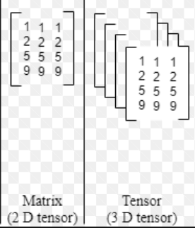

---
tags:
  - ba5
  - improc
  - numpy
  - cheatsheet
class: improc
url: https://moodle.unige.ch/course/view.php?id=2291
description: idiomatic and useful numpy / data science stuff
---

<!--toc:start-->
- [Numpy Quick Notes & tips](#numpy-quick-notes-tips)
  - [Slicing](#slicing)
    - [1 – 1 liner to modify whole image / tensor (n x m x 3)](#1-1-liner-to-modify-whole-image-tensor-n-x-m-x-3)
    - [2 — Conditional Slicing](#2-conditional-slicing)
  - [Mean — Sort](#mean-sort)
  - [Np.stack](#npstack)
    - [TODO!](#todo)
  - [[array([[1, 0, 1, 2],
       [2, 1, 2, 2],
       [2, 2, 0, 2]]), array([[0, 0, 1, 1],
       [1, 1, 0, 1],
       [0, 0, 0, 2]])]
------](#array1-0-1-2-2-1-2-2-2-2-0-2-array0-0-1-1-1-1-0-1-0-0-0-2)
  - [[array([[1, 1, 1, 2],
       [1, 1, 1, 2],
       [1, 2, 2, 0]]), array([[0, 1, 0, 0],
       [1, 1, 0, 1],
       [2, 0, 1, 2]])]
------](#array1-1-1-2-1-1-1-2-1-2-2-0-array0-1-0-0-1-1-0-1-2-0-1-2)
  - [array([[1, 1, 1, 0],
       [0, 2, 2, 0],
       [2, 2, 1, 2]]), array([[1, 0, 1, 0],
       [2, 0, 0, 2],
       [2, 1, 0, 2]])]
------](#array1-1-1-0-0-2-2-0-2-2-1-2-array1-0-1-0-2-0-0-2-2-1-0-2)
    - [comment ^^ and format / rewrite this](#comment-and-format-rewrite-this)
  - [Tile](#tile)
- [Matplotlib](#matplotlib)
<!--toc:end-->

# Numpy Quick Notes & tips


## Slicing 

### 1 – 1 liner to modify whole image / tensor (n x m x 3)


```python
import numpy as np
test = np.zeros((5, 5, 3))
test[:,:] = [0,0,100];

```


1. test = np.zeros((5, 5, 3)): Here, a NumPy array test is created using the np.zeros function. The array has dimensions 5x5x3, meaning it's a 3D array with a shape of 5 rows, 5 columns, and 3 color channels (for an RGB image).

2. test[:,:] = [0,0,100]: This line assigns the RGB color [0, 0, 100] to all elements in the 5x5x3 array. The [:,:] is a slice notation that selects all rows and columns in the array.

So, after this code, the test array will contain the RGB color [0, 0, 100] in all its elements. If you were to visualize this as an image, it would be a solid blue color.

i.e. [:,:] selectionne toutes les colonnes => toute la matrice
e.g.

test[:,:,2] => selectionne toutes les 3e colonnes
i.e. on une image => une liste de liste de vecteur 1x3. chaque element est du type `[0, 0, 0]`

```python
array([[[  0.,   0., 100.],
        [  0.,   0., 100.],
        [  0.,   0., 100.],
        [  0.,   0., 100.], ...

        [[  0.,   0., 100.],
        [  0.,   0., 100.],
        [  0.,   0., 100.],
        [  0.,   0., 100.],
        [  0.,   0., 100.]]])
```

Ici `test[:,:,2]` return la composante bleu de tous les pixels (r,g,b) i.e. la colonne 2 (3e) de chaque colonne.
(une colonne ou une ligne est juste une liste/vecteur de pixel => une liste d'array 1x3 )

i.e. 

```python
array([[100., 100., 100., 100., 100.],
       [100., 100., 100., 100., 100.],
       [100., 100., 100., 100., 100.],
       [100., 100., 100., 100., 100.],
       [100., 100., 100., 100., 100.]])
```

```python
test[:,:, 2] *= 2

test
> array([[[  0.,   0., 200.],
        [  0.,   0., 200.],
        [  0.,   0., 200.],
        [  0.,   0., 200.],
        [  0.,   0., 200.]],

test[:, :, 2]

> array([[200., 200., 200., 200., 200.],
       [200., 200., 200., 200., 200.],
       [200., 200., 200., 200., 200.],
       [200., 200., 200., 200., 200.],
       [200., 200., 200., 200., 200.]])
```

<br>

### 2 — Conditional Slicing

Look at this black magic of a python code:

```python
def add_salt_and_pepper(im_input: np.ndarray, proba: float) -> np.ndarray:
    img = np.array(im_input) # copy input
    rnd = np.random.rand(img.shape[0], img.shape[1])
    img[rnd < proba/ 2] = 0
    img[rnd > 1 - proba/ 2] = 1
    return img
```

- **Explanation**:

    1. `img = np.array(im_input)`: This line creates a copy of the input image using NumPy's array function. It ensures that the original image (im_input) is not modified directly.

    2. `rnd = np.random.rand(img.shape[0], img.shape[1])`: This line generates a random matrix (rnd) with the same dimensions as the input image. The values in this matrix are uniformly distributed random numbers between 0 and 1.

    3. `img[rnd < proba / 2] = 0`: Here, pixels in the image are set to 0 (black) where the corresponding values in the random matrix (rnd) are less than proba / 2. The condition rnd < proba / 2 ensures that only a fraction (proba / 2) of the pixels are affected, introducing "pepper" noise.

    4. `img[rnd > 1 - proba / 2] = 1`: Similarly, pixels in the image are set to 1 (white) where the corresponding values in the random matrix are greater than 1 - proba / 2. This introduces "salt" noise.

    The modified image is returned.

    The proba parameter controls the intensity of the noise. The higher the proba, the more intense the salt and pepper noise will be. If you have any specific questions or need further clarification, feel free to ask!

- **Further expl of why the `img[rnd< proba / 2]` and `img[rnd > 1 - proba / 2]`**


    1. `rnd < proba / 2`: This creates a boolean mask with the same shape as `img`. The values in this mask are `True` where the corresponding values in the `rnd` matrix are less than `proba / 2` and `False` otherwise. This mask effectively identifies a subset of pixels in the image.

    2. `img[rnd < proba / 2] = 0`: Using the boolean mask, this line modifies the values of the `img` array only at the positions where the mask is `True`. Specifically, it sets those pixel values to 0.

    The rationale behind this operation is to introduce "pepper" noise to the image. The condition `rnd < proba / 2` is determining which pixels should be affected by the noise. Since `rnd` contains random values between 0 and 1, the condition is true for a fraction of pixels determined by the value of `proba / 2`. If `proba` is 0.1, for example, it means that approximately 10% of the pixels will be affected.

    In other words, this line of code randomly selects a subset of pixels in the image and sets their values to 0, creating dark spots (pepper) in the image. The randomness is introduced by the random values in the `rnd` matrix, and the intensity of the noise is controlled by the `proba` parameter.

    - **Example** 
        1. `proba = 0.5`
        ```python
        rnd < proba / 2 
        rnd < 0.25 

        rnd > 1-proba/2 
        rnd > 1- 0.25 = 0.75
        rnd > 0.75

        ```

        value greater than 0.75 and below 0.25
        get replaced => 25% + 25% = 50% ok

        2. `proba = 0.4`
        ```python
        rnd < proba / 2
        rnd < 0.2
        
        rnd > 1 - proba / 2
        rnd > 1 - 0.2
        rnd > 0.8

        0.8 - 0.2 = 0.6 => left untouched => 0.4 replaced
        ```
        amount of values that get replaced in `img` is
        random values of `rnd` in [0, 0.2]  $\cup$ [0.8, 1]
        => 0.2 + 0.2 = 0.4 ok


***

<br>

## Mean — Sort


1.  **Cols**
    ```python
    a = np.random.randint(4, size=(3, 2))
    print(a)
    a.mean(0) # mean for cols because there 2 mean component (1 for each col)
    ```


    ```Python
    [[3 0]
     [3 3]
     [3 2]]
     
    array([3.        , 1.66666667])
    ```

2. **Rows**
    ```python
    a.mean(1) # mean for rows because there 3 mean component (1 for each row)
    ```


    ```Python
    [[3 0]
     [3 3]
     [3 2]]

     array([0. , 1.5, 1.5])
    ```


3.  **3D**
    ```python
    a = np.random.randint(4, size=(3, 2, 3))
    print(a)
    a.mean(1) # mean for rows because there 3 mean component (1 for each row, 3 rows)
    ```


    ```Python
    [[[3 1 2]
      [2 3 0]]

     [[2 2 3]
      [1 2 1]]

     [[0 0 2]
      [2 3 2]]]
     

    array(
      [[2.5, 2. , 1. ],
       [1.5, 2. , 2. ],
       [1. , 1.5, 2. ]])

    ```


4. 
    ```python
    a.mean(0) # mean for cols because there 2 mean component (1 for each col, 2 cols)
    ```

    ```Python
    [[[3 1 2]
      [2 3 0]]

     [[2 2 3]
      [1 2 1]]

     [[0 0 2]
      [2 3 2]]]


    array([[2.33333333, 1.        , 1.        ],
           [2.33333333, 2.        , 2.33333333]])
    ```


5. 
    ```python
    print(a.shape)
    a.mean(2) # mean for lignes internes because there 3 mean component (1 for each elem, 3 times 2 pixel/vector)
    ```

> [!HINT]
> Mean of each element. If each element is a pixel i.e. 3 vector => mean of that vector / pixel for each entry in "2d matrix" of pixel.
> i.e. 3D matrix => 2D matrix where each pixel is replaced by the mean of its rgb component.


```python
(3, 2, 3)
[[[2 2 2]
  [0 2 0]]

 [[2 1 0]
  [0 1 2]]

 [[0 2 0]
  [1 1 0]]]

array(
  [[2.        , 0.66666667],
   [1.        , 1.        ],
   [0.66666667, 0.66666667]])
```

***

<br>

## Np.stack

### TODO!

arrays = [np.random.randint(0, 3, (3, 4)) for _ in range(2)]
assert np.array([res[0,0], res[1,0]]).all() == res[:,0].all()
print(arrays)
print("------")
res = np.stack(arrays, 2)
print(res.shape)
print(res, "\n\n")
print(res[:,0])

[array([[1, 0, 1, 2],
       [2, 1, 2, 2],
       [2, 2, 0, 2]]), array([[0, 0, 1, 1],
       [1, 1, 0, 1],
       [0, 0, 0, 2]])]
------
(3, 4, 2)
[[[1 0]
  [0 0]
  [1 1]
  [2 1]]

 [[2 1]
  [1 1]
  [2 0]
  [2 1]]

 [[2 0]
  [2 0]
  [0 0]
  [2 2]]] 


[[1 0]
 [2 1]
 [2 0]]


----

stack 1


[array([[1, 1, 1, 2],
       [1, 1, 1, 2],
       [1, 2, 2, 0]]), array([[0, 1, 0, 0],
       [1, 1, 0, 1],
       [2, 0, 1, 2]])]
------
(3, 2, 4)
[[[1 1 1 2]
  [0 1 0 0]]

 [[1 1 1 2]
  [1 1 0 1]]

 [[1 2 2 0]
  [2 0 1 2]]] 


[[1 1 1 2]
 [1 1 1 2]
 [1 2 2 0]]


 ----


 stack 0 


 array([[1, 1, 1, 0],
       [0, 2, 2, 0],
       [2, 2, 1, 2]]), array([[1, 0, 1, 0],
       [2, 0, 0, 2],
       [2, 1, 0, 2]])]
------
(2, 3, 4)
[[[1 1 1 0]
  [0 2 2 0]
  [2 2 1 2]]

 [[1 0 1 0]
  [2 0 0 2]
  [2 1 0 2]]] 


[[1 1 1 0]
 [1 0 1 0]]


### comment ^^ and format / rewrite this

list of matrix => each row of matrix became an element of the bigger tensor containing the 2 mat. I.e. "concatenate according to row"
row 1 = mat1
Row 2 = mat2
col

***

For axis = 1 =>  
(3,4)=> (3,2,4)
3 rows 4 cols => 3 rows 2 cols 4 depth
Cols of 3d is array of rows of inner 2d.

Splits the 2d 3x4 matrix into 3 lines of 2x4 matrix.  
=> take =>  
=> [1st row of mat 1, 1st row of mat 2]  
=> [2nd row of mat 1, 2nd row of mat 2]  
=> [3rd row of mat 1, 3rd row of mat 2]

**Always takes first $k$ value of each matrix in array. Where $k$ is the value of the n-th dimension when calling `np.stack(axis=n)`. It _will_ split the original matrices**


<br />


## Tile

Repeat input matrix on a given axis (matrix may need to be broadened with smth like `mat[:,:, np.newaxis]` to pass from 2D to 3D)

We used it like this in tp01:
```python
gd = np.tile(np.linspace(0, 255, 500, dtype=u8), (125, 1))

# adds third axis and asks to "repeat current matrix" 3 times along that axis
# i.e. 3 layer of current matrix ==> tensor of shape (125, 500, 3)
grad_col = np.tile(gd[:,:,np.newaxis], (1, 3))
print(grad_col[:,:,0])

imshow(grad_col)
```

Using tile is stonks because before we used this
```python
gd = gray_scale
gd2 = deepcopy(gd)
gd3 = deepcopy(gd)
grad_col = np.stack([gd, gd2, gd3], -1)  # full "gradient"
```

But it can be reduce to

```python
grad_col = np.tile(gd[:, :, np.newaxis], (1, 3))
```
We duplicate given matrix 3 new times and "lines them in depth" to make a block of 3 matrix (1 for red, 1 for green 1 for blue => our tensor)



(except that on this image on the right we have a block of 4 and not 3)

NB: `grad_col[:,:, 0]` makes us access the 1st matrix "in front" (i.e. red components) and `grad_col[:,:, 2]` the 3rd, last, i.e. blue

- gray_scale is a $125\times500$ matrix of $[0, 1, 2, ...., 255]$

- Both make a grayscale like so:

- 

(We made a grayscale with "full" pixels i.e. 3D tensor even tho we could have just used) 
```python
linear_gradient = np.tile(np.linspace(0, 255, 500, dtype=u8), (125, 1))  # (1, 500) matrix
plt.imshow(linear_gradient, aspect="auto", cmap="gray")
```

<br />

What's useful with that is that we can convert it to a colored grayscale by just setting 2 of the 3 channel to 0.
(Since we have 3 channels with components from 0 to 255)

```Python
# shut off green cmp
grad_col[:, :, 1] = 0

# Reverse blue cmp to be 255 -> 0 instead of 0 -> 255 (i.e. Start at full blue end at full red)
grad_col[:, :, 2] = 255 - grad_col[:, :, 0]
```

***

<br />

# Matplotlib


- Use `plt.stem()`, instead of `plt.plot()` in some case its nice
